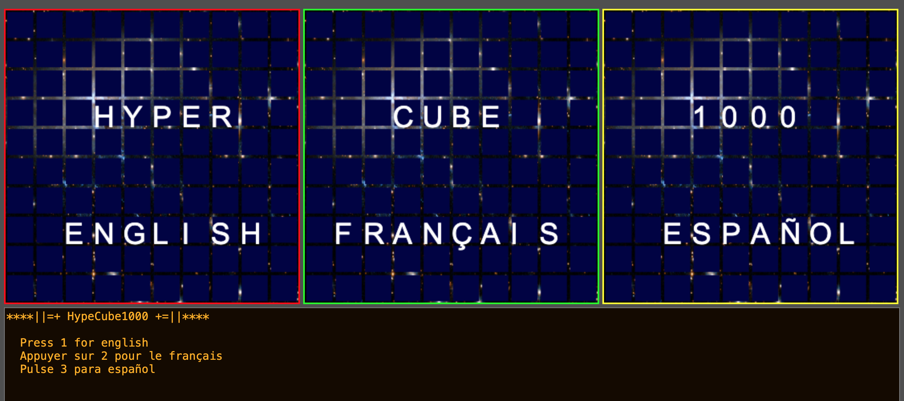

# HyperCube1000

Prototype using three 2d canvases to navigte a cube.

</img>
</img>

# Play in browser

[Click Here](https://doomlazer.github.io/HyperCube1000)

# Instructions

[English](help/helpEN.txt)

[Español](help/helpSP.txt)

[Français](help/helpFR.txt)