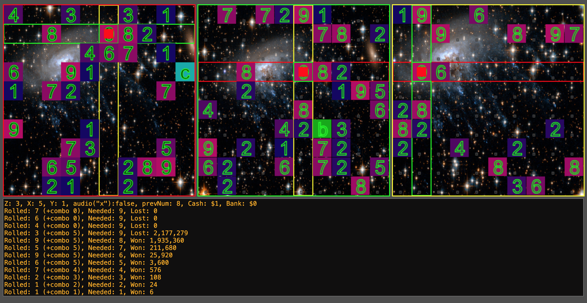

# HyperCube1000

Prototype using three 2d canvases to navigte a cube. Requires a window width of 1240px to format propperly.

</img>

# Instructions

[Click Here](https://doomlazer.github.io/HyperCube1000/help/helpEN.txt)

# Play in browser

[Click Here](https://doomlazer.github.io/HyperCube1000)